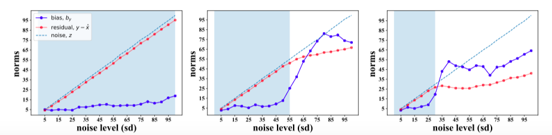
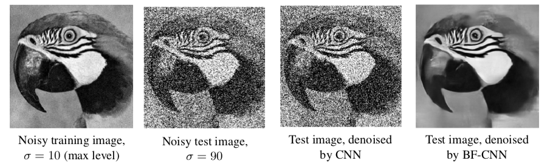
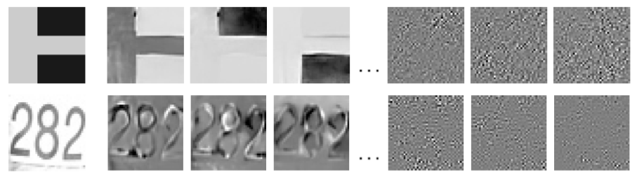

This website contains information, code and models from the paper [Robust And Interpretable Blind Image Denoising Via Bias-Free Convolutional Neural Networks](https://arxiv.org/abs/1906.05478) by [Sreyas Mohan](https://sreyas-mohan.github.io) \*, [Zahra Kadkhodaie](https://www.linkedin.com/in/zahra-kadkhodaie-1b415680) \*, [Eero P Simoncelli](https://www.cns.nyu.edu/~eero/) and [Carlos Fernandez-Granda](https://cims.nyu.edu/~cfgranda/).[\* represents equal contribution]

The problem of denoising consists of recovering a signal from measurements corrupted by noise. In the past decade, convolutional neural networks have achieved state-of-the-art results in image denoising. Despite their success, these solutions are mysterious: we lack both intuition and formal understanding of the mechanisms they implement. In this work:
* we show that current deep-learning models cannot generalize outside the noise levels they are trained on. We propose Bias-Free networks that generalize to new noise levels outside the training and achieve state-of-the-art results. 
* we provide novel tools for analyzing the mechanisms implemented by neural networks to denoise natural images.

## Network Bias Impairs Generalization

 

## Bias-Free Networks Generalize Across Noise Levels
 

## Bias-Free Networks Implements Non-Linear Adaptive Filtering
 

## Bias-Free Networks Implements Projection Onto Low Dimensional Adaptive Subspaces
 

## Pre-Trained Models and Code
Please visit [our github page](https://labforcomputationalvision.github.io/bias_free_denoising/) for pre-trained models, code and instructions on how to use the code. 
