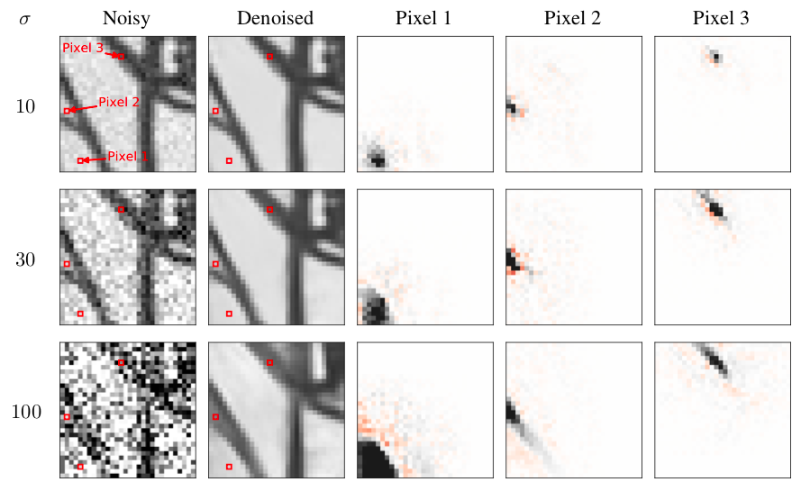

This website contains information, code and models from the paper [Robust And Interpretable Blind Image Denoising Via Bias-Free Convolutional Neural Networks](https://arxiv.org/abs/1906.05478) by [Sreyas Mohan](https://sreyas-mohan.github.io) \*, [Zahra Kadkhodaie](https://www.linkedin.com/in/zahra-kadkhodaie-1b415680) \*, [Eero P Simoncelli](https://www.cns.nyu.edu/~eero/) and [Carlos Fernandez-Granda](https://cims.nyu.edu/~cfgranda/) [\* equal contribution], presented/published at the International Conference on Learning Representations (ICLR), April 2020.

Deep Convolutional Neural Networks have produced state-of-the-art results in the problem of removing noise from images. These networks do not generalize well to noise levels beyond the range on which they are trained. But removing the additive bias terms from the networks allows robust generalization, even when the network is trained only on barely-visible levels of noise. In addition, the removal of bias simplifies analysis of network behavior, which indicates that these denoisers perform projections onto local adaptively-estimated subspaces, whose dimensionality varies inversely with noise level.

## Bias-Free Networks Generalize Across Noise Levels

We construct a *bias- free* CNN (BF-CNN) from a given CNN by removing additive (bias) terms from every stage of the network (including BatchNorm layers). The figure below shows the denoising of an example natural image by a CNN and its bias-free counterpart (BF-CNN), both trained over noise levels in the range [0, 10] (image intensities are in the range [0, 255]). The CNN performs poorly at high noise levels (90, far beyond the training range), whereas BF-CNN performs at state-of-the-art levels.
 
 
Since bias-free networks do not have additive constants, they are locally linear. We perform a local analysis of BF-CNN networks, which reveals the underlying denoising mechanisms learned from the data.

## Bias-Free Networks Implements Non-Linear Adaptive Filtering

Locally, BF-CNN is linear and hence the each denoised pixel is computed as a weighted average of noisy pixels in the neighbourhood. The images in the three rightmost columns show the weighting functions used to compute each of the indicated pixels (red squares). Their shapes vary substantially, and are adapted to the underlying image content. As the noise level increases, the spatial extent of the weight functions increases in order to average out the noise, while respecting boundaries between different regions in the image, which results in dramatically different functions for each pixel.

 

## Bias-Free Networks Implements Projection Onto Low Dimensional Adaptive Subspaces

The local linear structure of a BF-CNN facilitates analysis of its functional capabilities via the singular value decomposition (SVD). Analyzing the SVD of a BF-CNN we emprically observe the local linear mapping is very low dimensional and  (approximately) symmetric and thus, the network is projecting the noisy signal onto a low-dimensional subspace. This is confirmed by visualizing the singular vectors as images as shown below. The singular vectors corresponding to non-negligible singular values (the first three columns) are seen to capture features of the input image; those corresponding to near-zero singular values (the last three columns) are unstructured.
 

## Pre-Trained Models and Code
Please visit [our github page](https://github.com/LabForComputationalVision/bias_free_denoising) for pre-trained models, code and instructions on how to use the code. 

## More Resources:
* [Paper and reviews](https://openreview.net/forum?id=HJlSmC4FPS)
* [Local copy of paper](https://www.cns.nyu.edu/~lcv/pubs/makeAbs.php?loc=MohanKadkhodaie19b)
* [Conference video and slides](https://iclr.cc/virtual/poster_HJlSmC4FPS.html)
